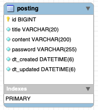

# 비밀번호를 활용한 게시판 서비스

------
# 📎 목차
1. [Posting-board-service](#-posting-board-service)
2. [개발기간](#-개발기간)
3. [기능 구현 분석](#-기능-구현-분석)
4. [기술 스택](#-기술-스택)
5. [ERD](#-erd)
6. [API EndPoint](#-api-endpoint)

---
# 🚀 Posting Board Service
- 비밀번호를 활용한 게시판 서비스 
  - 조회, 생성은 바로 가능하지만, 수정, 삭제는 비밀번호를 확인해야 한다. 

# 📆 개발기간
- 개발 기간 : 2022.09.06 ~ 2022.09.07

---
# 📝 기능 구현 분석
### 게시판 서비스

1. 사용자는 게시글을 올릴 수 있다.
   - 게시글은 제목과 본문으로 구성된다.
   - 제목은 최대 20자, 본문은 200자로 서버에서 제한한다.
   - 제목과 본문 모두 이모지가 포함될 수 있다.
   
2. 사용자는 게시글을 올릴 때 비밀번호를 설정할 수 있다. 
   1. 추후 본인이 작성한 게시물에 비밀번호를 입력 후 수정, 삭제할 수 있다.
      - 회원가입, 로그인 없이 비밀번호만 일치하면 수정, 삭제 가능하다.
      - 비밀번호는 데이터베이스에 암호화된 형태로 저장된다.
      - 비밀번호는 6자 이상이어야 하고, 숫자는 1개 이상 반드시 포함되어야 한다.

3. 모든 사용자는 한 페이지 내에서 모든 게시물을 최신 글 순서로 확인 할 수 있어야 한다.

### 게시글 조회

1. 게시글의 개수가 많을 때, 사용자가 스크롤을 내릴 때마다 오래된 글들이 계속 로드되는 형태로 API 를 수정해.
   - 게시글이 중복으로 나타나면 안된다.
   - 추가 로드는 20개 단위로 한다.
   
---

# 🛠 기술 스택
Language | Framwork | Database | Tools
|:----: | :-----: | :-----: | :---: | 
|  |  |  |   |

---

# 📚 ERD

---

# 🎯 API EndPoint

| endpoint   | HTTP Method | 기   능 | require parameter                                      | response data |
|------------|-------------|-----------|--------------------------------------------------------|---------------|
| posting/ | GET         | 게시글 조회    | -                                                      | 게시글 조회 여부     |
| posting/ | POST        | 게시글 생성    | title: string content: string password: string | 게시글 생성 성공여부   |
| posting/ | PUT         | 게시글 수정    | title: string content: string password: string | 게시글 수정 성공여부   |
| posting/ | DELETE      | 게시글 삭제    | password: string                                       | 게시글 삭제 성공여부   |

---

